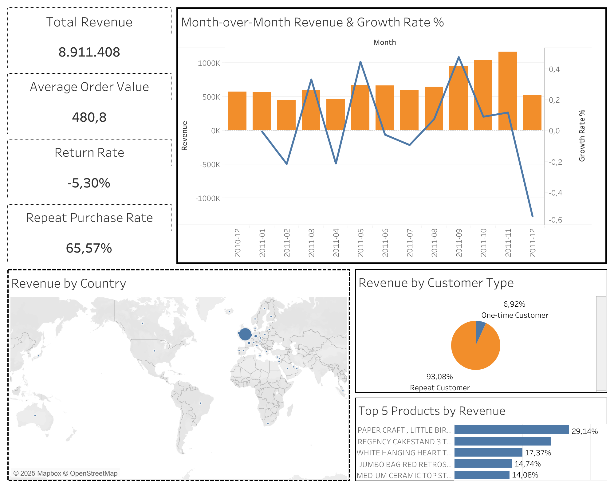

# Business Analyst KPI Project

Companies in retail and e-commerce depend on tracking their key performance indicators (KPIs) such as revenue, average order value, customer retention, and return rates. Without proper tracking, managers struggle to identify sales trends, optimize operations, and improve customer satisfaction. 

## Project Overview

This project analyzes an e-commerce dataset of 500K+ transactions to simulate the role of a business analyst. The objective was to calculate essential KPIs—such as revenue growth, average order value, and repeat purchase rate—that managers use to track performance. By designing an interactive Tableau dashboard, I translated raw data into business insights that could guide retention strategies and revenue optimization.

## Dataset 

In this project, I analyzed a publicly available e-commerce dataset containn 500K+ online retail transactions. 

Available [here](https://www.kaggle.com/datasets/carrie1/ecommerce-data).

## Dataset Overview 

The dataset has 541909 rows and 8 columns. The columns consist of: 

    InvoiceNo (order ID)
    StockCode (product ID) 
    Description (product name)
    Quantity
    InvoiceDate
    UnitPrice
    CustomerID
    Country

## Business Questions

1. How are sales and revenue trends over time? 
2. What are the top customers and products that drive revenue?
3. What is the Average Order Value (AOV) and how does it vary? 
4. How often do customers return? What is the repeat purchase rate? 
5. What is the return rate (orders with negative quantities)?
6. Which countries contribute the most to sales? 

## Tools and Technologies

- Python (Pandas, Numpy) for data cleaning
- SQL (BigQuery) for queries and KPI calculation
- Tableau for dashboard and visualization

## Data Cleaning and Preparation 

- Cleaning Null Values
- Remove negative quantities and keeping them separate for return analysis
- Converting dates 
- Adding a revenue column 

<details>
<summary>Python: Data Cleaning Steps</summary>

```python
# Drop nulls
df = df.dropna(subset=["CustomerID", "Description"])

# Remove negative/zero quantities (keep them separately for return analysis)
returns = df[df["Quantity"] < 0]
df = df[df["Quantity"] > 0]

# Convert dates
df["InvoiceDate"] = pd.to_datetime(df["InvoiceDate"])
df["Month"] = df["InvoiceDate"].dt.to_period("M")

# Add Revenue column
df["Revenue"] = df["Quantity"] * df["UnitPrice"]
```
</details>

## KPIs Calculated and Tracked

- Total Revenue
- Average Order Value (AOV)
- Monthly Sales Growth
- Repeat Purchase Rate
- Top 5 Products by Revenue
- Return Rate

<details>
<summary>SQL: Data Analysis Steps</summary>

``` sql
--- Calculating Total Revenue
SELECT SUM(Revenue) AS total_revenue
FROM `capstone-project-371607.e_commerce_dataset_20102011.ecommerce-cleaned`
WHERE Quantity > 0;

--- Average Order Value (AOV)
SELECT SUM(Quantity * UnitPrice) / COUNT(DISTINCT InvoiceNo) AS avg_order_value
FROM `capstone-project-371607.e_commerce_dataset_20102011.ecommerce-cleaned`
WHERE Quantity > 0;

--- Month-over-Month Growth %
SELECT Month,
       SUM(Quantity * UnitPrice) AS monthly_revenue,
       (SUM(Quantity * UnitPrice) - 
        LAG(SUM(Quantity * UnitPrice)) OVER (ORDER BY Month)) 
        / LAG(SUM(Quantity * UnitPrice)) OVER (ORDER BY Month) * 100 AS growth_rate
FROM `capstone-project-371607.e_commerce_dataset_20102011.ecommerce-cleaned`
WHERE Quantity > 0
GROUP BY Month
ORDER BY Month;

--- Repeat Purchase Rate
SELECT 
  COUNT(DISTINCT CASE WHEN order_count > 1 THEN CustomerID END) * 1.0 /
  COUNT(DISTINCT CustomerID) AS repeat_purchase_rate
FROM (
  SELECT CustomerID, COUNT(DISTINCT InvoiceNo) AS order_count
  FROM `capstone-project-371607.e_commerce_dataset_20102011.ecommerce-cleaned`
  GROUP BY CustomerID
) t;

--- Repeat Purchase Revenue Share
WITH cust_stats AS (
  SELECT
    CustomerID,
    COUNT(DISTINCT InvoiceNo) AS order_count,
    SUM(Quantity * UnitPrice) AS total_revenue
  FROM `capstone-project-371607.e_commerce_dataset_20102011.ecommerce-cleaned`
  GROUP BY CustomerID
)
SELECT
  SAFE_DIVIDE(
    SUM(CASE WHEN order_count > 1 THEN total_revenue ELSE 0 END),
    SUM(total_revenue)
  ) AS repeat_revenue_share   -- fraction (0-1)
FROM cust_stats;

--- Return Rate
SELECT 
  (SELECT COUNT(DISTINCT InvoiceNo) 
   FROM `capstone-project-371607.e_commerce_dataset_20102011.ecommerce-returns`) * 1.0
  /
  (SELECT COUNT(DISTINCT InvoiceNo) 
   FROM `capstone-project-371607.e_commerce_dataset_20102011.ecommerce-cleaned`) AS return_rate;

--- Top 5 Products by Revenue
SELECT 
  Description AS product_name,
  SUM(Quantity * UnitPrice) AS total_revenue
FROM `capstone-project-371607.e_commerce_dataset_20102011.ecommerce-cleaned`
WHERE Quantity > 0
GROUP BY product_name
ORDER BY total_revenue DESC
LIMIT 5;
```

</details>

## Tableau Dashboard

[View Interactive Dashboard on Tableau Public](https://public.tableau.com/app/profile/meltem.ergin/viz/e-commerce-kpi-analysis-project/Dashboard)



## Results and Insights

Key findings from the analysis include:

- **Growth driven by volume**: Revenue growth is mainly coming from an increase in the number of orders, rather than higher spend per order. This suggests an opportunity to **optimize Average Order Value (AOV)**.  
- **Seasonal peak**: Revenue peaked in **November 2011**, driven by seasonal demand.  
- **Repeat customers matter**: Although **repeat customers** represent a smaller share of buyers, they contributed **~70% of total revenue** — highlighting the importance of **prioritizing retention strategies** over pure acquisition.  
- **Return rate**: The **return rate** was **~15%**, concentrated in specific product categories.  
- **Top products drive revenue**: The **top 5 products** contributed disproportionately to overall revenue.  
- **Regional performance differences**: Certain regions outperform others in both orders and revenue, potentially due to better logistics, brand awareness, or targeted marketing campaigns.
